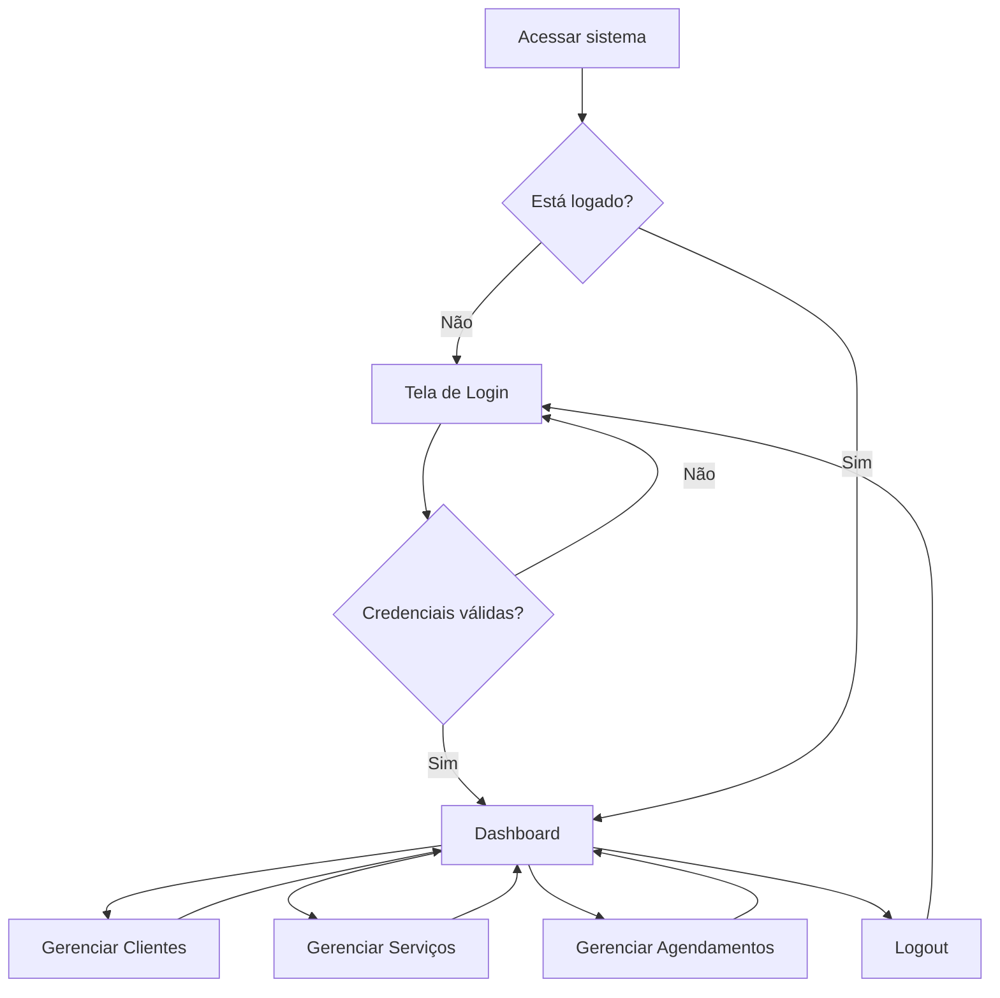

# Documento de Escopo — Barbearia Tesoura de Ouro

**Projeto Integrador | 2º Semestre | Sistemas para Internet**  
**Autor:** Natan Silva Tavares  
**Data:** Junho/2026

---

## 1. Identificação do projeto

| Item | Descrição |
|------|-----------|
| **Nome do projeto** | Barbearia Tesoura de Ouro |
| **Tipo de negócio** | Barbearia de bairro |
| **Equipe** | Natan Silva Tavares (desenvolvedor individual) |

---

## 2. Contexto e problema

A barbearia **Tesoura de Ouro** precisa de uma forma simples e confiável de organizar o atendimento. Hoje, o controle manual de clientes, serviços e horários pode causar:

- Agendamentos duplicados ou esquecidos
- Dificuldade para consultar a agenda do dia
- Perda de dados de clientes
- Falta de padronização nos preços e duração dos serviços

---

## 3. Objetivo do sistema

Desenvolver uma **aplicação web dinâmica** que permita ao administrador da barbearia gerenciar clientes, serviços e agendamentos de forma centralizada, com autenticação, banco de dados relacional e operações CRUD completas.

---

## 4. Usuário principal

| Perfil | Descrição | Acesso |
|--------|-----------|--------|
| **Administrador** | Dono ou responsável pela barbearia | Login completo no painel administrativo |

> Clientes da barbearia **não possuem login**. Eles são cadastrados pelo administrador para uso nos agendamentos.

---

## 5. Funcionalidades

### 5.1 Autenticação
- Tela de login com e-mail e senha
- Validação de credenciais no banco de dados
- Área administrativa protegida por sessão
- Logout

### 5.2 Dashboard
- Contadores de clientes, serviços e agendamentos
- Listagem dos agendamentos do dia

### 5.3 CRUD — Clientes
- Cadastrar cliente (nome, telefone, e-mail)
- Listar todos os clientes
- Editar dados do cliente
- Excluir cliente
- Validação: nome apenas com letras; telefone apenas com números

### 5.4 CRUD — Serviços
- Cadastrar serviço (nome, duração em minutos, preço)
- Listar, editar e excluir serviços

### 5.5 CRUD — Agendamentos (entidade principal)
- Criar agendamento vinculando cliente + serviço + data/hora
- Listar agendamentos por data (filtro)
- Editar agendamento (status: agendado, concluído, cancelado)
- Excluir agendamento
- Registrar observações opcionais

---

## 6. Modelagem do banco de dados

### Entidades e relacionamentos

```
users (1) ──────< appointments >────── (1) clients
                      │
                      └────── (1) services
```

| Tabela | Campos principais | Relacionamento |
|--------|-------------------|----------------|
| `users` | id, name, email, password_hash, role | Criador do agendamento |
| `clients` | id, name, phone, email | Cliente do agendamento |
| `services` | id, name, duration_minutes, price | Serviço do agendamento |
| `appointments` | id, client_id, service_id, scheduled_at, status, notes, created_by | Entidade central |

---

## 7. Fluxo principal do sistema



---

## 8. Requisitos técnicos atendidos

| Requisito | Implementação |
|-----------|---------------|
| Autenticação | `backend/login.php` + `backend/app/auth.php` |
| Banco de dados | MySQL com 4 tabelas relacionadas (`database/schema.sql`) |
| CRUD completo | Clientes, Serviços e Agendamentos |
| Separação front/back/banco | Pastas `frontend/`, `backend/`, `database/` |
| Middleware de autenticação | Funções `require_login()` e `require_admin()` |
| Interface funcional | Dashboard, tabelas, formulários, navegação |
| Versionamento Git | Repositório no GitHub |

---

## 9. Identidade visual

| Elemento | Definição |
|----------|-----------|
| **Paleta** | Dourado (`#d4a017`), azul (`#4f7cff`), fundo claro e modo noturno escuro |
| **Tipografia** | System UI (Segoe UI, Roboto, Arial) |
| **Logotipo** | Barbearia Tesoura de Ouro (versão clara e escura conforme o tema) |
| **Ícone** | Tesoura estilizada (favicon) |

---

## 10. Fora do escopo (nesta versão)

- Área de login para clientes finais
- Agendamento online pelo cliente
- Notificações por e-mail ou WhatsApp
- Relatórios financeiros avançados
- App mobile

---

## 11. Entregáveis

| Entregável | Status |
|------------|--------|
| Aplicação web funcional | Concluído |
| Banco de dados modelado | Concluído |
| Documento de escopo | Concluído |
| Repositório GitHub | [Link do repositório](https://github.com/Natan-Silva-Tavares/Projeto-Integrador-Segundo-semestre---Barbearia) |
| README com instruções | Concluído |
| Protótipo Figma | Entrega separada (Design System) |

---

## 12. Referências

- Repositório: https://github.com/Natan-Silva-Tavares/Projeto-Integrador-Segundo-semestre---Barbearia
- Documentação PHP: https://www.php.net/
- Documentação MySQL: https://dev.mysql.com/doc/
